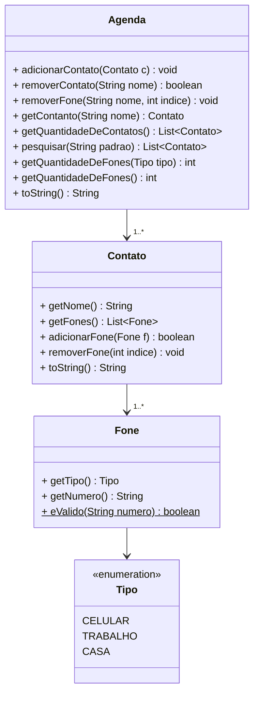

# Agenda Telefônica

---


Fonte: <a href="https://www.freepik.com/free-vector/add-friends-concept-illustration_13247148.htm#fromView=search&page=1&position=33&uuid=ab7e4751-9b50-441c-804b-d32097fca36c&query=phone+contact" target="_blank">FreePik</a>

> O objetivo dessa atividade é implementar uma agenda que possui vários contatos e cada contato possui vários telefones.

## 🎯Requisitos Funcionais

### ✅ 1. Estrutura da Agenda
- A agenda deve armazenar os contatos ordenadamente.
- Um contato possui um **nome único** e pode conter vários telefones.
- Cada telefone possui um **tipo** (exemplo: casa, trabalho, celular) e um número.

### ✅ 2. Manipulação de Contatos
- Para adicionar um **contato**, é necessário informar um nome e pelo menos um **telefone válido**.
- Caso um contato já exista, seus telefones **devem ser mesclados** com os novos telefones, evitando duplicatas.
- Deve ser possível remover um contato da agenda informando seu nome.

### ✅ 3. Manipulação de Telefones
- Um telefone deve ter um tipo (como casa, trabalho, celular) e um número.
- Apenas números válidos podem ser cadastrados.
  - Formato aceito: 0123456789()-.
- Deve ser possível remover um telefone de um contato pelo índice na lista de telefones.

### ✅ 4. Exibição dos Contatos
- Os contatos devem ser exibidos em ordem alfabética.
- A saída do programa deve seguir este formato:

```
- Adriele [0:Claro:(77)89085-9077] [1:Tim:(63)61730-9301]
- Ariele [0:Trabalho:(24)62362-1925] [1:Oi:(79)98614-1326]
- Biatriz [0:Trabalho:(80)63810-9092] [1:Oi:(59)67638-0967] [2:Casa:(59)67638-0967]
```


### ✅5. Busca Inteligente
- Deve ser possível realizar uma busca em todos os atributos do contato, incluindo:
  - Nome
  - Tipo do telefone
  - Número do telefone
- A busca deve ser insensível a maiúsculas e minúsculas.
- Exemplo: ao pesquisar "maria", os seguintes contatos devem ser retornados:
```
- Maria Julia [0:Trabalho:(11)98888-7766]
- Mariana [0:Oi:(85)90000-1234]
- Ana Maria [0:Casa:(31)99999-5678]
```

### ✅ 6. Relatórios da Agenda
- Mostrar quantos telefones existem por tipo de tipo (exemplo: Trabalho: 5, Casa: 3).
- Mostrar a quantidade total de telefones cadastrados na agenda.

## 🧱 Diagrama UML


## Exemplo de execução 
```java
public class Runner {
  public static void main(final String[] args) {

    Agenda agenda = new Agenda();

    Contato contato1 = new Contato("Adriele");
    contato1.adicionarFone(new Fone(Tipo.CLARO, "(77)89085-9077"));
    contato1.adicionarFone(new Fone(Tipo.TIM, "(63)61730-9301"));
    System.out.println(contato1);

    Contato contato2 = new Contato("Biatriz");
    contato2.adicionarFone(new Fone(Tipo.TRABALHO, "(80)63810-9092"));
    System.out.println(contato2);

    Contato contato3 = new Contato("Ariele");
    contato3.adicionarFone(new Fone(Tipo.TRABALHO, "(24)62362-1925"));
    contato3.adicionarFone(new Fone(Tipo.OI, "(79)98614-1326"));
    if(!contato3.adicionarFone(new Fone(Tipo.VIVO, "(24)62362-abc"))){
      System.out.println("fail: numero de telefone invalido");
    }
    System.out.println(contato3);

    agenda.adicionarContato(contato1);
    agenda.adicionarContato(contato2);
    agenda.adicionarContato(contato3);
    System.out.println(agenda);

    int quantidade = agenda.quantidadeDeFones(Tipo.TRABALHO);
    System.out.println("Total de telefones (Trabalho): " + quantidade);

    Contato contato4 = new Contato("Biatriz");
    contato4.adicionarFone(new Fone(Tipo.OI, "(59)67638-0967"));
    contato4.adicionarFone(new Fone(Tipo.CASA, "(59)67638-0967"));
    agenda.adicionarContato(contato4);
    System.out.println(agenda);

    agenda.removerFone("Adriele", 1);
    System.out.println(agenda);

    int quantidadeTotal = agenda.quantidadeTotalDeFones();
    System.out.println("Total de telefones na agenda: " + quantidadeTotal);

    if (!agenda.removerContato("Alex")) {
      System.out.println("fail: contato não encontrado");
    }

    ArrayList<Contato> resultados = agenda.pesquisar("le");
    for(Contato resultado : resultados)
      System.out.println(resultado);
  }
}
```